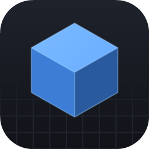
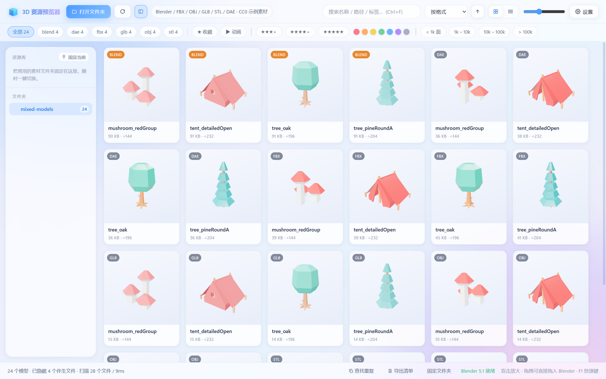
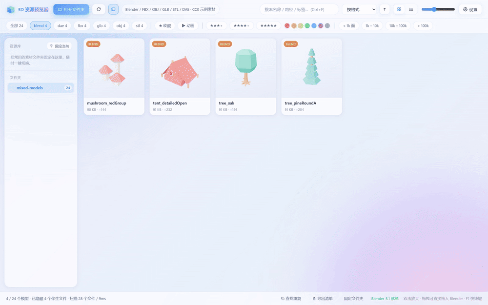
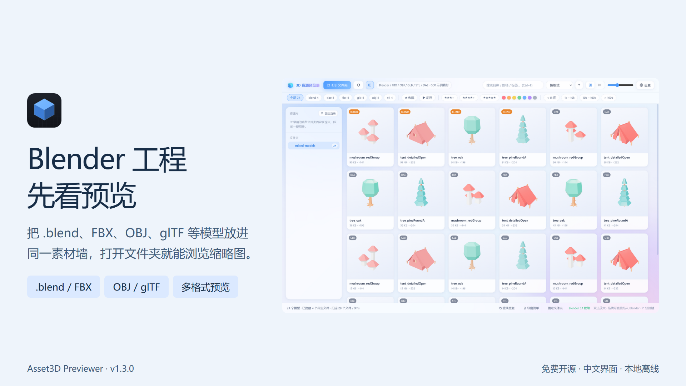
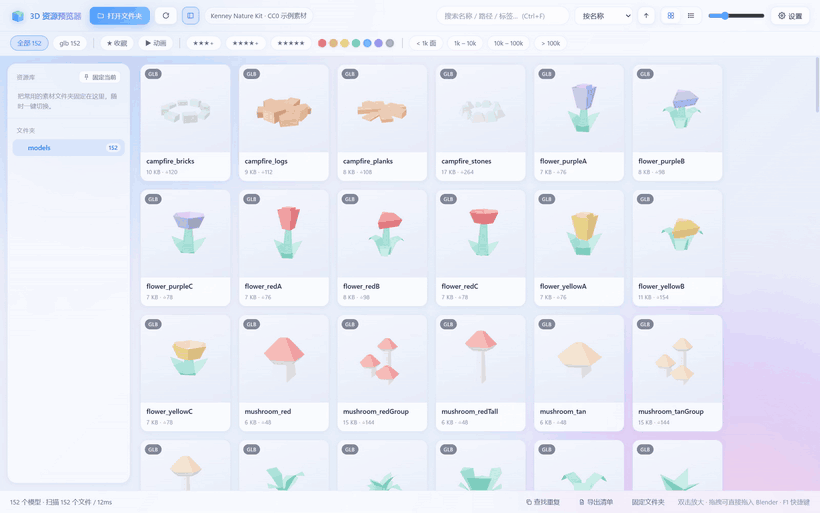
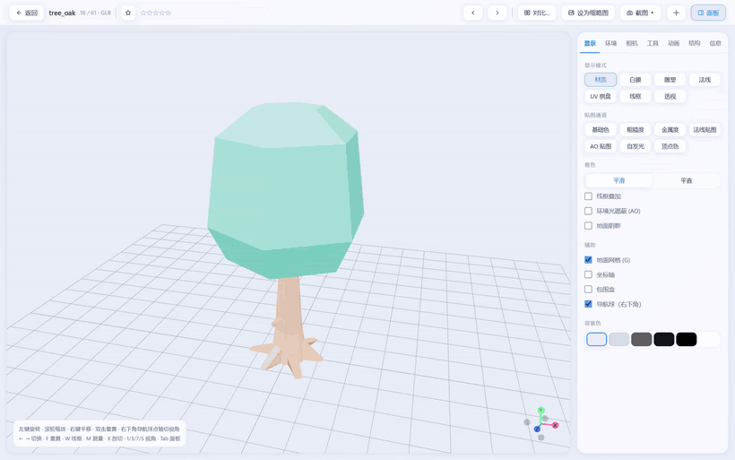
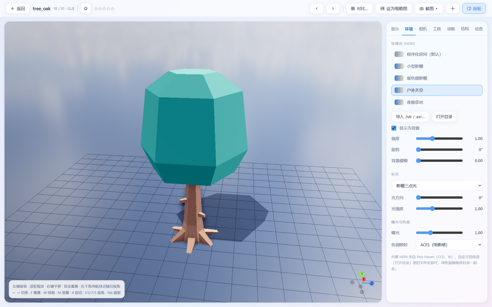
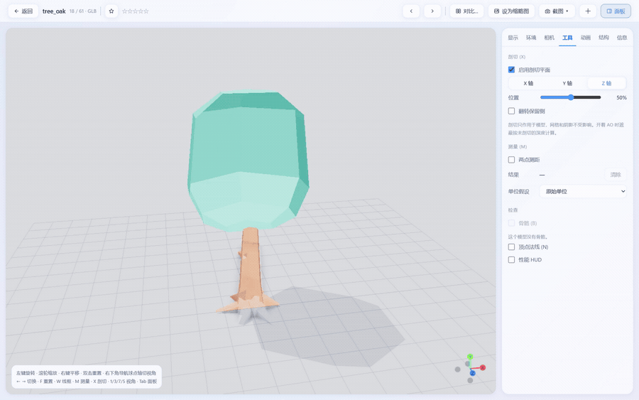
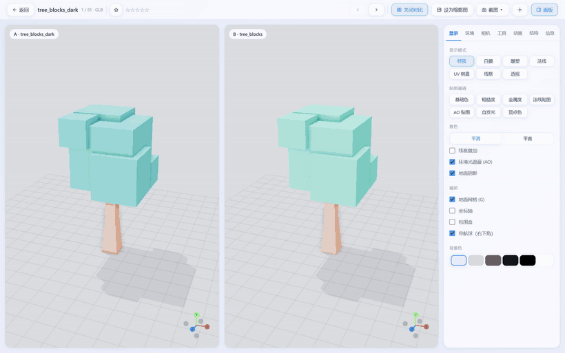

<div align="center">
  
  <h1>3D 资源预览器</h1>
  <p><strong>让 .blend、FBX、glTF 等模型，直接出现在素材墙里。</strong></p>
  <p>Blender 文件预览 · 多格式缩略图 · 免费开源 · Windows 绿色版</p>
  <p>
    <a href="https://github.com/1127075982ak47-dev/asset3d-previewer/releases/download/v1.3.0/Asset3D-Previewer-v1.3.0-win64-portable.zip"><strong>下载 Windows 绿色版</strong></a>
    &nbsp; · &nbsp;
    <a href="https://github.com/1127075982ak47-dev/asset3d-previewer/releases/download/v1.3.0/Asset3D-Previewer-v1.3.0-source.zip">下载完整源码</a>
    &nbsp; · &nbsp;
    <a href="https://github.com/1127075982ak47-dev/asset3d-previewer/releases/tag/v1.3.0">全部下载与更新说明</a>
  </p>
  <p>
    <a href="https://github.com/1127075982ak47-dev/asset3d-previewer/actions/workflows/ci.yml"></a>
    <a href="LICENSE"></a>
    <a href="https://github.com/1127075982ak47-dev/asset3d-previewer/releases/latest"></a>
  </p>
</div>

你的素材目录里，可能既有 **Blender `.blend` 工程**，也有 **FBX、OBJ、GLB / glTF** 模型。
打开一个文件夹，就能在同一面素材墙里浏览这些文件的缩略图，先看清模型，再决定用哪一个。

## 先看支持哪些格式

| 资源类型 | 支持的格式 | 如何预览 |
|---|---|---|
| **Blender 工程** | **`.blend`** | 读取可用内嵌预览图；调用本机 Blender 自动生成模型缩略图与交互预览 |
| **常用模型** | **FBX、GLB / glTF、OBJ、STL、PLY、DAE** | 内置加载器直接生成缩略图、进入三维查看 |
| 其他模型与场景 | 3DS、3MF、WRL、VRM、USDZ、AMF、DRC、LWO、VOX、KMZ、MD2、PMX / PMD、3DM | 内置对应加载器 |
| 点云、科学数据与动作 | PCD、VTK / VTP、XYZ、GCode、BVH | 按对应数据类型显示点、几何体、路径或骨骼 |
| 识别并列出，暂不能预览 | MAX、MA / MB、C4D、SKP、ABC、USD、STEP、IGES 等 | 保留文件卡片，可整理或使用默认程序打开 |

**27 种扩展名可通过内置加载器读取，另支持 Blender `.blend` 预览。**
`.bin`、`.mtl`、贴图与常见导入元数据作为伴生文件隐藏，让素材墙集中显示模型。
外部依赖与不同加载器的限制见 [完整使用说明](docs/USER_GUIDE.md)。



## 重点：Blender `.blend` 也能生成预览

**内置 `.blend` 预览流程，自动转换默认开启。**
程序会自动探测本机常见位置的 Blender 安装；绿色版或自定义位置可在设置中指定 `blender.exe`。

| 你想做什么 | 软件如何处理 | 需要什么 |
|---|---|---|
| 快速浏览 `.blend` 缩略图 | 先提取文件保存时写入的可用内嵌图 | 文件含可用内嵌图；这一步无需运行 Blender |
| 为 `.blend` 生成模型预览 | 后台调用 Blender 转为 GLB，再生成缩略图；原 `.blend` 文件保留 | 本机有能打开该文件的兼容版本 Blender |
| 双击旋转、缩放与检查 | 查看转换后的模型，使用白膜、线框、HDRI、AO 等显示功能 | 同上；转换结果缓存，之后可复用 |



> `.blend` 支持已集成在程序中，绿色版不捆绑 Blender 安装。
> 没有可用内嵌图时，需要本机 Blender 生成预览；三维交互也需要 Blender。
> 交互预览显示的是 GLB 导出结果，具体流程与兼容边界见 [Blender 说明](docs/USER_GUIDE.md#关于-blend)。

## 再看一段真实演示

[](https://github.com/1127075982ak47-dev/asset3d-previewer/releases/download/v1.3.0/Asset3D-Previewer-v1.3.0-demo-zh.mp4)

**[观看 / 下载 88 秒中文功能讲解](https://github.com/1127075982ak47-dev/asset3d-previewer/releases/download/v1.3.0/Asset3D-Previewer-v1.3.0-demo-zh.mp4)** · 1080p / 30 fps · 软件实际录制

*A free, open-source, offline 3D asset browser for Windows: browse Blender .blend projects and mixed-format model libraries with thumbnail previews. Interactive .blend viewing uses a compatible local Blender installation.*

## 翻一翻素材墙

选一个文件夹，模型自动生成缩略图。网格与列表随时切换，可搜索名称、路径和标签；
大素材库优先处理当前可见模型。收藏、星级、颜色和标签，把好用的素材留在手边。



## 给模型换一种看法

双击进入查看器，切换 **材质、白膜、雕塑、法线、UV、线框或透视**。
平滑 / 平直、线框叠加、AO、阴影和贴图通道检查，都可以按需要调整。



## 换一套光照，发现另一面

内置四张小体积 HDRI，支持导入自己的 **HDR / EXR**。
环境光强度、旋转、曝光和色调映射可调整；也能选择让环境直接出现在背景里。



## 切开看内部，并排看差别

剖切平面沿 X / Y / Z 轴移动，检查模型内部；两点测量、骨骼、顶点法线和结构面板用于进一步查看。



选中两个模型进入 **A/B 对比**，联动旋转和缩放，直观看到版本、颜色或结构的区别。



## 看完，还能整理与导出

- **资源库**：固定常用目录、收藏、标签、评分、颜色筛选，以及记录备份与导入。
- **文件整理**：重命名、移动、重复查找和回收站；处理已识别依赖，报告同名冲突与部分失败。
- **导出**：GLB、原格式、截图、透明 PNG 转盘序列、接触表和 CSV 清单。
- **Blender**：提取 `.blend` 内嵌图，调用已安装的兼容版本转换或打开模型。

## 下载与开始使用

当前稳定版本：**v1.3.0**。普通用户选择绿色版，完整解压后双击 `3D资源预览器.exe`。

| 下载 | 适合谁 | 说明 |
|---|---|---|
| **[Windows 绿色版](https://github.com/1127075982ak47-dev/asset3d-previewer/releases/download/v1.3.0/Asset3D-Previewer-v1.3.0-win64-portable.zip)** | 直接使用 | 完整运行文件，约 153 MB；无需 Node.js |
| **[完整源码](https://github.com/1127075982ak47-dev/asset3d-previewer/releases/download/v1.3.0/Asset3D-Previewer-v1.3.0-source.zip)** | 查看与编译源码 | v1.3.0 公开源码与锁文件 |
| **[完整开发工程（含 Git 历史）](https://github.com/1127075982ak47-dev/asset3d-previewer/releases/download/v1.3.0/Asset3D-Previewer-v1.3.0-developer-with-history.zip)** | 换电脑继续开发 | 源码、文档与经过整理的公开提交历史 |
| [SHA256 校验清单](https://github.com/1127075982ak47-dev/asset3d-previewer/releases/download/v1.3.0/Asset3D-Previewer-v1.3.0-SHA256.json) | 校验下载文件 | 文件大小、公开提交与 SHA256 |
| [中文功能演示](https://github.com/1127075982ak47-dev/asset3d-previewer/releases/download/v1.3.0/Asset3D-Previewer-v1.3.0-demo-zh.mp4) | 先了解功能 | 约 88 秒，1080p / 30 fps，约 25 MB |

1. 完整解压绿色版，运行 exe。
2. 按 **Ctrl+O** 打开素材目录，双击缩略图查看模型。
3. 左键旋转、滚轮缩放、右键平移；**Esc** 返回，**F1** 查看快捷键。

Windows 10/11 x64。GPU 硬件加速默认开启，修改后需重启。
升级时先关闭程序，再把旧版 `data` 复制到新版 exe 同级；记录按绝对素材路径关联。

> `.blend` 的 3D 交互需要兼容版本 Blender。MAX、C4D、SKP、STEP 等私有或 CAD 格式只列出，不能直接预览。
> 目前发布包尚未代码签名；验证范围见 [验收报告](docs/RELEASE_VALIDATION.md)。

## 开发与一起改进

```powershell
git clone https://github.com/1127075982ak47-dev/asset3d-previewer.git
cd asset3d-previewer
npm run setup
npm run dev
```

需要 Node.js ≥22.12.0，建议 Node.js 24。`setup` 按锁文件安装依赖并校验 Electron 下载。

```powershell
npm run typecheck
npm test
npm run build
npm run pack
```

欢迎提交 [问题与建议](https://github.com/1127075982ak47-dev/asset3d-previewer/issues) 或 Pull Request。
开发流程见 [贡献指南](CONTRIBUTING.md)，换机开发见 [交接说明](HANDOFF.md)，安全报告见 [SECURITY.md](SECURITY.md)。
公开开发分支 `main` 包含最新文档与演示；Release 源码附件对应正式版本。

## 验证与文档

- **104 项单元测试**，以及实际查看器、资源库、文件故障和 EXE 检查。
- GitHub Windows CI 自动执行类型检查、单元测试和构建。
- 版本标签自动构建绿色版；正式下载包由维护者验证后发布。

[快速使用](docs/QUICKSTART.txt) · [完整功能与技术说明](docs/USER_GUIDE.md) · [更新日志](CHANGELOG.md) · [验收范围](docs/RELEASE_VALIDATION.md) · [演示素材说明](docs/SHOWCASE.md)

## 致谢与第三方代码

这个项目使用了以下优秀的开源组件。它们保留各自的版权和许可，感谢原作者与贡献者。

| 组件 | 在项目中的用途 | 许可 |
|---|---|---|
| [Blender](https://www.blender.org/)（外部程序） | `.blend` 文件转换，使用用户本机安装 | [GNU GPL](https://www.blender.org/about/license/)；绿色版不捆绑 Blender |
| [Electron](https://github.com/electron/electron) | 桌面运行环境与窗口 | MIT；Chromium 等随附组件采用各自许可 |
| [React](https://github.com/facebook/react) | 中文界面与交互 | MIT |
| [three.js](https://github.com/mrdoob/three.js) | 3D 渲染、相机、加载器、后处理与导出器 | MIT |
| [DRACO](https://github.com/google/draco) | 压缩几何解码 | Apache-2.0 |
| [Basis Universal](https://github.com/BinomialLLC/basis_universal) | KTX2 / Basis 压缩纹理解码 | Apache-2.0 |
| [rhino3dm](https://github.com/mcneel/rhino3dm) | Rhino 3DM 解码 | MIT |
| [pngjs](https://github.com/pngjs/pngjs) | PNG 编解码 | MIT |
| [fzstd](https://github.com/101arrowz/fzstd) / [fflate](https://github.com/101arrowz/fflate) | zstd 与 ZIP 解压 | MIT |
| [Vite](https://github.com/vitejs/vite) / [electron-vite](https://github.com/alex8088/electron-vite) | 开发与构建 | MIT |
| [electron-builder](https://github.com/electron-userland/electron-builder) | Windows 打包 | MIT |
| [TypeScript](https://github.com/microsoft/TypeScript) / [Vitest](https://github.com/vitest-dev/vitest) | 类型检查与测试 | Apache-2.0 / MIT |

**素材来源**：内置 HDRI 来自 [Poly Haven](https://polyhaven.com/license)，示例录屏中的模型来自 [Kenney Nature Kit](https://kenney.nl/assets/nature-kit)，均采用 CC0。示例模型不随程序分发。

**演示制作**：真实软件录屏由 [HyperFrames](https://github.com/heygen-com/hyperframes) 编排，使用 [GSAP](https://gsap.com/standard-license/) 动效和 [FFmpeg](https://ffmpeg.org/) 编码；讲解为本机 Windows 中文语音合成。制作工具不随软件发布。

项目代码采用 **[MIT 许可](LICENSE)**。许可全文与素材说明见 [第三方许可说明](docs/THIRD_PARTY_NOTICES.txt) 和 [素材许可](docs/ASSET_LICENSES.md)。
